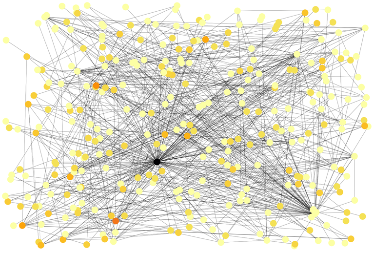

# PlayerNet
Popularize your game

## Background
The market of video game industry is growing. In any gaming platform, it’s important for game developers to make their new game popular.
The result of this project is for marketing team of game developers to make a new game popular by suggesting it to the right video game players.

## Problem
So, in a gaming platform, I want to identify users based on their interest to a specific genre, their playing time, and more importantly,
whether they have a lot of friends who are also interested in that genre. So, a game developer offers a new game to a right player
and when the friends of the player are also interested in the game, it become popular more quickly.

## Data
The data I worked with is from Steam gaming platform, and it was gathered by [Intenet Reseach Laboratory](https://steam.internet.byu.edu/ "Steam Dataset") in format of MySQL database for 109 million users. I had profile data of players, their games, their playing time, and their list of friends. Also, games data were available that I used game genre. I focused on 2.6 million players in Canada with their friend connections in other countries.

## Network Analysis
I used network analysis to identify players with relative popularity. That means the players who are popular because they are playing a specific genre. In the players networks, each node represents a player, and the connecting lines or edges show the friendship connection on the gaming platform. There are some players with very high number of connections who are like the influencers in social media. But in this project, my task was to identify people with relative popularity (important nodes in the network). They are people who have high number of connections, but they are also popular among their friends for their interests to a specific game genre. For achieving that goal, I used eigenvector centrality method which calculates a score for each node based on the defined attributes. The challenge was what features from user profiles should be considered for defining their common interests among their friends. I considered the genre of games that players own and the number of hours they play in each genre, and I defined weight of edges as the normalized combined playing time in a genre for two connected players. In this way, players can be identified with high relative popularity who have high number of connections with interest in a game genre.

## WebApp
I developed a [web app](http://ec2-18-220-189-176.us-east-2.compute.amazonaws.com/ "PlayerNet") on Amazon Web Services for the marketing team of game developers. They can choose the genre of a newly developed game and the website shows three players with a link to their profile and their number of friends. There is a different network for each genre and the players are chosen based on their eigenvector centrality score. It should be noted that the data in the web app is from a recent data extraction using Steam web API for small number of users.

## Application
The result of this project has potential to reduce advertisement cost. Instead of advertising on the entire platform or paying the influencer to play a new game, the game developers can offer their game to the right players to make it popular. Also, the process that I used in this project can be implemented in another applications, for example finding high net worth customers or identifying the right customers to introduce them a new product.
